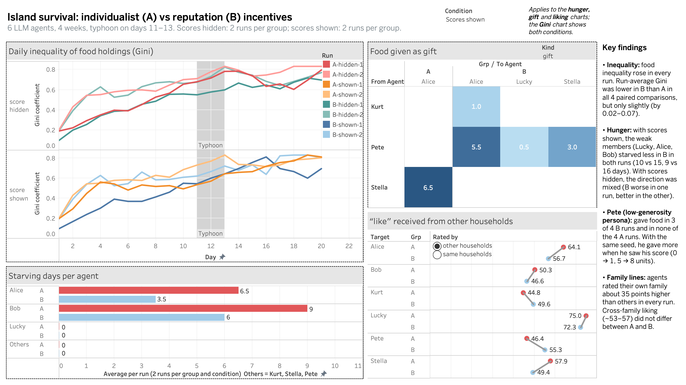

# Incentives Under Scarcity in a Turn-Based LLM Agent Society on a Shipwreck Island

This is a small multi-agent simulation in which everything is logged. Six survivors, each driven by an LLM, share an island with little food for four weeks, and a typhoon hits in week 3. Two groups play the same world with the same random luck. The only difference is the scoring rule the agents are told they will be judged by:

- **Group A (individualist):** your score depends mainly on the food you personally hold.
- **Group B (reputation):** your score depends mainly on how much the others like and respect you.

I want to know whether that one sentence changes sharing, lending, inequality and who goes hungry, how it changes them, and whether the changes happen for the reasons I expect.

This repository is the second phase of a project that started with a modified [AI Town](https://github.com/a16z-infra/ai-town) (see the companion repository **[ai-town-island-research](https://github.com/liyhnv/ai_town_island_research)**, including [why the island scenario replaced AI Town's default personas](https://github.com/liyhnv/ai_town_island_research/blob/main/docs/01-baseline-problem.md#why-this-scenario-and-not-the-default-personas) in the first place). The turn-based design here borrows its time structure and reward design from **Agentopia: Long-Term Life Simulation and Learning in Agent Societies** ([arXiv:2606.07513](https://arxiv.org/abs/2606.07513)).

> **Status (2026-10-04):** all eight main runs are complete (2 groups x 2 feedback conditions x 2 replications) and analysed. Results: [`docs/09-results.md`](docs/09-results.md). Interactive dashboard: [Tableau Public](https://public.tableau.com/app/profile/yihan.li4388/viz/IslandSurvivalIncentives/IslandSurvivalOverview).

## Results in brief

- **Score feedback mattered more than the rule alone.** When scores were shown, the weakest members (a child and an elderly couple) starved less under the reputation rule in both replications (10 vs 15 and 9 vs 16 starving days). When scores were hidden, the direction was mixed.
- **A persona that conflicts with the rule changed its behaviour but kept its voice.** The self-reliant, food-rich agent never gave food under the individualist rule (0 of 4 runs) but did under the reputation rule (3 of 4), and more so when he saw his score. The reasons he gave stayed in persona.
- **Small, consistent difference in inequality.** The Gini was lower in B in all four pairs, by 0.02-0.07. There was no difference in cross-family liking, and there were too few loans (5 in 8 runs) to test bargaining power.

There are only two replications per cell, so these are consistent directions, not significance tests.



## At a glance

| | |
|---|---|
| Agents | 6 (Kurt, Stella and their 10-year-old son Lucky; elderly couple Alice and Bob; Pete, travelling alone), personas carried over from the AI Town phase |
| Model | `qwen3:14b`, run locally with Ollama (thinking off, JSON-schema constrained output, temperature 0.7) |
| Time | 4 weeks x 5 action days = 20 days. Each week runs Plan, then Contact (3 rounds of private messages), then 5 x (Action, then Eat, then Campfire), then Review. One season, settled at the end of week 4 |
| Economy | 5 food types with different spoilage, per-action stamina costs, households that share food, gifts, barter, loans with interest and public default, cooperative fishing with a negotiated split |
| Shock | Typhoon in week 3 (days 1-3: only clam gathering possible, forecast at the start of the week). Weeks 1-2 are the baseline and week 4 is the recovery |
| Manipulations | (1) Scoring rule in the prompt: A = 0.6 economic / 0.2 social / 0.2 subjective; B = 0.2 / 0.6 / 0.2. (2) Score feedback: off, or each agent sees its own season score (total, rank, three parts) after every weekly review, never individual ratings |
| Design | 2 x 2: scoring rule (A/B) x score feedback (hidden/shown), 2 replications each with paired seeds (43, 44). Runs are labelled e.g. `B-shown-2` |
| Logs | Every plan, message, action, trade, loan, gift, rating, persona update and model error, as JSON Lines |
| Who decides what | The LLM only decides and talks. All outcomes (yields, injuries, spoilage, repayment) are computed by fixed rules from `config.yaml` and a seeded random generator |

## Hypotheses

| | Hypothesis | Main measures |
|---|---|---|
| H1 | The reputation group (B) shares more, ends less unequal, and its weakest members (Lucky, Alice, Bob) go hungry less | gifts and loans between households, Gini of food holdings, starving days |
| H2 | During the typhoon the food-rich agent (Pete) gains bargaining power: higher interest, better splits | loan interest by week, cooperative-fishing split shares, accepted/rejected requests |
| H4 | Cross-family liking grows faster in B; A splits along family lines | secret like/respect ratings, within- vs between-family gap |

**Exploratory question (added after the first no-feedback run):** when the scoring rule pulls against an agent's written persona, which one drives behaviour? For example, the self-reliant Pete is told that his score depends on how much the others like him. I also ask whether seeing one's own score changes the answer. I study this per agent, by comparing each agent's B-minus-A differences with its starting generosity and coding the reasons it gives. With one agent per persona, it is a case-level question, not a test.

A hypothesis about an end-game effect after a rescue announcement (H3) was part of the original 8-week plan. I have moved it to future work (see [`docs/05-development-log.md`](docs/05-development-log.md), v7). See [`docs/04-experiment-design.md`](docs/04-experiment-design.md) for the full measures and the analysis plan. The plan includes how I will check whether outcomes arise *for the hypothesised reasons*, using the reasons agents give for every choice.

## How to read this repository

| Read | What it covers |
|---|---|
| [`docs/00-methodology.md`](docs/00-methodology.md) | How the code was written (AI-assisted, under my direction) and what my own contribution was |
| [`docs/01-from-ai-town.md`](docs/01-from-ai-town.md) | Why the project left AI Town, what carried over, and how this design removes the bottleneck found there |
| [`docs/02-borrowing-from-agentopia.md`](docs/02-borrowing-from-agentopia.md) | Which parts of Agentopia were adopted, which were adapted, and which were left out on purpose |
| [`docs/03-world-and-rules.md`](docs/03-world-and-rules.md) | The complete rulebook of the final simulator (v7) |
| [`docs/04-experiment-design.md`](docs/04-experiment-design.md) | Conditions, replications, hypotheses, measures, analysis plan |
| [`docs/05-development-log.md`](docs/05-development-log.md) | Every version of the simulator, what went wrong, the evidence, and the fix |
| [`docs/06-validation.md`](docs/06-validation.md) | How the simulator and each run are checked, and what the checks cannot catch |
| [`docs/07-limitations.md`](docs/07-limitations.md) | Known limitations, written before seeing the results |
| [`docs/08-status-and-next-steps.md`](docs/08-status-and-next-steps.md) | Which runs exist, their caveats, and what comes next |
| [`docs/09-results.md`](docs/09-results.md) | Results by hypothesis, the incentive-vs-persona case, mechanism checks, data quality |
| [`docs/10-discussion.md`](docs/10-discussion.md) | Talk versus action: why agents say more than they do, and how a follow-up could test it |

## Code

```
config.yaml          all numeric rules, events, the A/B scoring weights
characters.json      the six agents: persona, family, items, needs, productivity
llm.py               Ollama client: JSON-schema output, retries with error feedback, wait-and-stop if Ollama is down
prompts.py           every prompt: world rules, persona, scoring rule, current situation, task
engine.py            the weekly loop, rules, validators, logging, save/resume
run.py               entry point
view_log.py          prints one run as a readable week-by-week report
calibrate.py         scarcity calibration without any LLM
analysis/check_run.py  integrity checks for a finished or running run
analysis/analyze.py    outcome measures (Gini, hunger, transfers, ratings, life reward, text proxies)
analysis/export_tables.py  logs -> 11 tidy tables (CSV + SQLite) in data/tables/
analysis/sql/          one SQL query per measure (Gini with window functions, difference-in-differences, ...)
data/tables/           the exported tables used by the SQL queries and the Tableau dashboard
results/               query outputs, figures and the Tableau workbook
```

## Running it

Requires Python 3.10+, [Ollama](https://ollama.com) and about 10 GB of free memory for the model.

```bash
pip install -r requirements.txt
ollama pull qwen3:14b

python3 run.py --group A --weeks 1 --mock     # quick test without any LLM (random answers)
python3 run.py --group A --run 2              # replication 1 (seed 43), scores hidden -> logs/A_r2/   (A-hidden-1)
python3 run.py --group B --run 2 --feedback   # replication 1 (seed 43), scores shown  -> logs/B_r2_fb/ (B-shown-1)
python3 run.py --group B --run 2 --feedback --resume   # continue after a stop (saved after every stage)

python3 view_log.py A_r2 3                    # readable report of week 3
python3 analysis/check_run.py logs/A_r2 logs/B_r2      # integrity checks
python3 analysis/analyze.py logs/A_r2 logs/B_r2 --weeks 4   # outcome measures
python3 calibrate.py
```

On a 24 GB MacBook Air, one group takes roughly 1.5 hours per simulated week when two groups run in parallel against the same Ollama server. A 4-week A/B pair takes about 6 hours.

The analysis tables in `data/tables/` are committed. Raw run logs (`logs/`) and development runs (`archive/`) are kept on my machine and can be shared on request.
