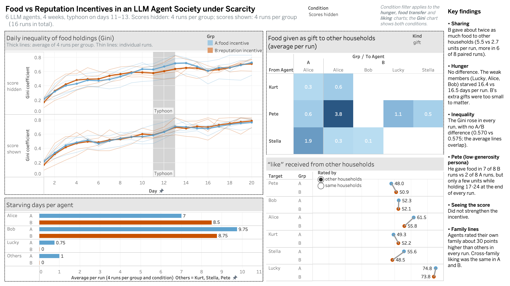

# Results

Sixteen runs, four weeks each, on simulator v6.2 / v7 (see [`04-experiment-design.md`](04-experiment-design.md)): two groups, two feedback conditions and four replications.

| | Group A (individualist) | Group B (reputation) |
|---|---|---|
| Scores hidden | `A-hidden-1` to `A-hidden-4` | `B-hidden-1` to `B-hidden-4` |
| Scores shown | `A-shown-1` to `A-shown-4` | `B-shown-1` to `B-shown-4` |

Runs are labelled *group-condition-replication*. Replications 1 to 4 use seeds 43 to 46, and runs with the same replication number share a seed, so A and B face the same luck. (Log folders keep the names given by `run.py`: replication *k* is `--run k+1`, for example `logs/B_r2_fb` is B-shown-1. `--run 1` was the v6 pilot.) Replications 1 and 2 were run on 3-4 October and replications 3 and 4 on 4-6 October, with identical code.

Every run passed all rule checks in [`06-validation.md`](06-validation.md). I compare A and B within each of the 8 pairs (same seed, same condition) and report how many pairs point the same way. There are no significance tests.

Interactive dashboard: [Tableau Public](https://public.tableau.com/app/profile/yihan.li4388/viz/IslandSurvivalIncentives/IslandSurvivalOverview). All numbers below can be reproduced with `analysis/export_tables.py --logs` and the queries in `analysis/sql/`.

## Summary

| Question | Answer | B better in |
|---|---|---|
| H1a: Does B share more? | Yes. 5.5 vs 2.7 units given across households per run on average | 6 of 8 pairs (1 tie) |
| H1b: Is B less unequal? | No clear difference. Average Gini 0.570 vs 0.575 | 5 of 8 pairs |
| H1c: Do B's weakest go hungry less? | No. Average starving days per run are the same in A and B | 4 of 8 pairs |
| H2: Does the food-rich agent gain bargaining power in the typhoon? | Not testable, since only 13 loans were made in 16 runs | - |
| H4: Does cross-family liking grow faster in B? | No. Cross-family liking is about the same in A and B (53-59 of 100) | 3 of 8 pairs |
| Score feedback | No consistent effect on any of the measures above | - |
| Exploratory: incentive vs persona (Pete) | The least generous persona gave food in 7 of 8 B runs and 2 of 8 A runs, but only small amounts | - |

In short, the reputation rule changed who gave food, but the amounts were too small to change hunger or inequality. Seeing the score made no consistent difference.

An earlier version of this page, written after two replications, reported that with scores shown the weakest members starved less in B in both replications. Replications 3 and 4 went the other way (B worse in both), so that claim did not hold up. I keep this note because it shows why the extra replications mattered.

## H1: Sharing, inequality and hunger

| Pair | Units given across households (A / B) | Run-average Gini (A / B) | Starving days, weak members (A / B) |
|---|---|---|---|
| hidden-1 | 0.5 / 2.0 | 0.557 / 0.505 | 9 / 21 |
| hidden-2 | 0.0 / 6.0 | 0.666 / 0.636 | 25 / 20 |
| hidden-3 | 5.5 / 12.5 | 0.615 / 0.578 | 27 / 11 |
| hidden-4 | 5.0 / 5.0 | 0.433 / 0.511 | 9 / 17 |
| shown-1 | 3.5 / 2.0 | 0.579 / 0.505 | 15 / 10 |
| shown-2 | 3.0 / 8.0 | 0.652 / 0.632 | 16 / 9 |
| shown-3 | 2.6 / 3.5 | 0.590 / 0.666 | 23 / 26 |
| shown-4 | 1.5 / 4.7 | 0.505 / 0.530 | 8 / 17 |
| **Average per run** | **2.7 / 5.5** | **0.575 / 0.570** | **16.5 / 16.4** |

The weak members are Lucky, Alice and Bob (60 person-days per run). Averages by condition: scores hidden A 17.5 / B 17.3 starving days, scores shown A 15.5 / B 15.5.

- **Sharing.** B gave more food across households in 6 of 8 pairs, about twice as much on average. This is the most consistent group-level difference.
- **Inequality** rose in every run, from about 0.2 on day 1 to 0.7-0.8 on day 20 (the maximum possible with six agents is about 0.83; why I use the Gini is explained in [`04-experiment-design.md`](04-experiment-design.md)). Most of the rise comes from Pete, who has the fishing gear and ends every run with 17-24 units. The A-B difference is small and changes sign between pairs.
- **Hunger** did not differ. Starving days vary a lot from run to run (8 to 27), and the variation follows the elderly couple's own work rather than the scoring rule. Bob, for example, rested on anywhere from 2 to 17 of the 20 days, sometimes even at full stamina, where resting gains nothing. The extra food B gave (about 3 units per run) is small next to the couple's need of 60 units over the four weeks.
- **Typhoon (difference-in-differences, `07_typhoon_did.sql`).** I measured the change in the weak members' average fullness from weeks 1-2 to weeks 3-4, B minus A. With scores hidden it was -20.1, +12.0, +29.0 and -2.7 points; with scores shown -10.1, +13.6, -2.3 and -10.6. The sign is not stable, so I do not claim a typhoon-specific incentive effect.

## H2: Bargaining power during the typhoon

Agents proposed 129 loans across the sixteen runs and 13 were made, at 11-33% interest. Pete was the lender in 11 of them (all 7 in A, 4 of 6 in B), mostly to Alice. He agreed to 9 of 68 requests to lend or trade food. With so few transactions, H2 cannot be evaluated. One contrast is worth keeping for the exploratory question below. In A, food moved from Pete to the elderly couple almost only as interest-bearing loans. In B it moved mostly as gifts.

## H4: Family lines

In every run agents rated their own family about 83-93 out of 100 and members of other families about 53-59. The gap (28-39 points) was smaller in B in only 3 of 8 pairs, and cross-family liking did not differ between A and B. H4 is not supported.

## Exploratory: incentive versus persona

Pete's written persona is self-reliant and ungenerous (starting generosity 25 of 100): "He doesn't see why he should hand over what he worked hard to gather to people who did nothing to earn it." He is also the richest agent. The reputation rule pulls directly against his persona.

| Units Pete gave | Rep. 1 | Rep. 2 | Rep. 3 | Rep. 4 |
|---|---|---|---|---|
| A, scores hidden | 0 | 0 | 0 | 2.5 |
| A, scores shown | 0 | 0 | 0 | 0.7 |
| B, scores hidden | 0 | 5.0 | 11.5 | 5.0 |
| B, scores shown | 1.0 | 8.0 | 1.5 | 2.5 |

- Pete gave food in 7 of 8 B runs (34.5 units in total) and in 2 of 8 A runs (3.2 units). This is the clearest incentive effect in the experiment.
- Score feedback did not add to it. With the same seed he gave more when he saw his score in replications 1 and 2, and less in replications 3 and 4.
- The amounts were small. Pete held 17-24 units at the end of every run, and an estimated 12-19 units of his food rotted during weeks 1-3 of each run (fish loses 40% a week). His weekly budget told him he could safely lend about 11 units on average. He still gave at most 11.5 units in a whole run, and 5 or fewer in most B runs.
- His gifts came with conditions ("only if you promise to help me with some work later", "I need to know you'll use it wisely"), and he preferred to teach others to fish rather than hand food over. His stated reasons rarely mention reputation or his score. Behaviour moved toward the incentive while his reasons stayed in character.
- Other families did not consistently like him more in B (higher in 4 of 8 pairs). The token gifts did not buy a better reputation.

**Same-seed check.** Runs with the same seed see identical prompts until the first score is shown at the end of week 1. For seeds 44, 45 and 46 all six hidden/shown pairs have identical food holdings for every agent on days 1-5 and diverge only from week 2. The simulator and model are therefore reproducible for a given seed, and differences between hidden and shown runs arise after feedback starts. (`A-hidden-1` and `B-hidden-1` ran on v6.2 and do not match their v7 counterparts in week 1, so this check is not available for seed 43.)

## Mechanism checks

- **What agents say.** Reputation-type words in weekly plans were more frequent in B in 5 of 8 pairs. Being told the reputation rule did not produce a stable shift in how agents justify their plans. (Keyword proxy only; the flagged passages still need to be read.)
- **Say-do gap.** I counted promise-like lines ("I can share...", "I'll give...") and checked whether a gift followed within a day. In B, 39 of 132 such lines (30%) were followed by a gift; in A, 13 of 86 (15%). B agents both promised more and gave more, but most promises were still not kept.
- **Persona drift** at the season end was nearly identical in A and B for every agent (for example, Pete's generosity went from 25 to 30 or 35 in every run). The bounded persona update follows the persona and the events, not the incentive.

## Data quality

| Fallbacks (default answer after 3 invalid tries) | Rep. 1 | Rep. 2 | Rep. 3 | Rep. 4 |
|---|---|---|---|---|
| A, hidden | 0 | 8 | 1 | 0 |
| B, hidden | 0 | 2 | 2 | 1 |
| A, shown | 3 | 5 | 1 | 1 |
| B, shown | 0 | 0 | 0 | 2 |

Fallbacks were more frequent in A (19) than in B (7), mostly in replication 2. Most are borrowers mis-filling loan amounts or agents trying to give more than their safe surplus allows. In both cases the agent's message is kept and only the invalid proposal is dropped. In replications 3 and 4 the counts were low and similar (A 3, B 5). This is listed in [`07-limitations.md`](07-limitations.md).

## What this does and does not show

- The reputation rule reliably changed **who gave** food, most clearly for the persona that conflicts with it. It did not change **how much** was given enough to affect hunger or inequality. The incentive moved gestures, not outcomes.
- Seeing one's own score did not make a consistent difference to any measure.
- Hunger is driven mainly by the weakest agents' own choices and luck, which vary a lot between runs. With two replications this looked like an incentive effect; with four it did not.
- Pete is both the least generous persona and the richest agent, so persona and position cannot be separated.

The gap between what agents say and what they do, and what I would try next, is discussed in [`10-discussion.md`](10-discussion.md).
